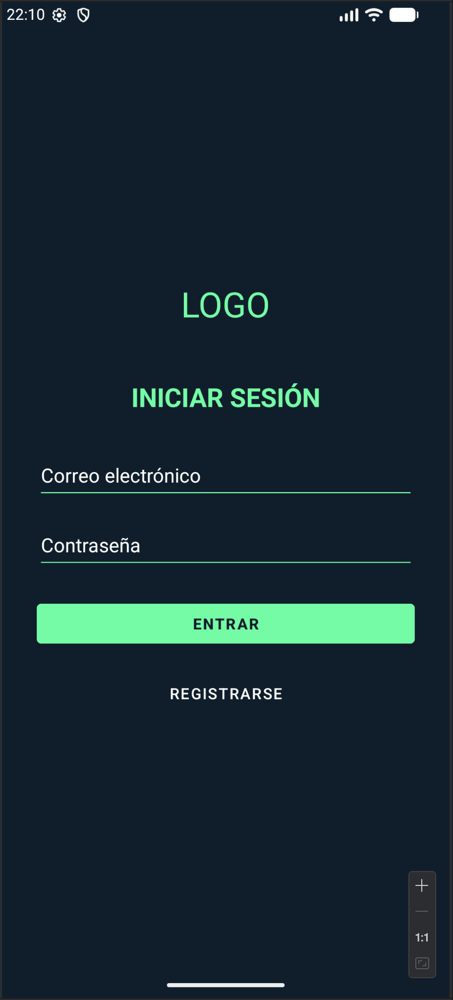
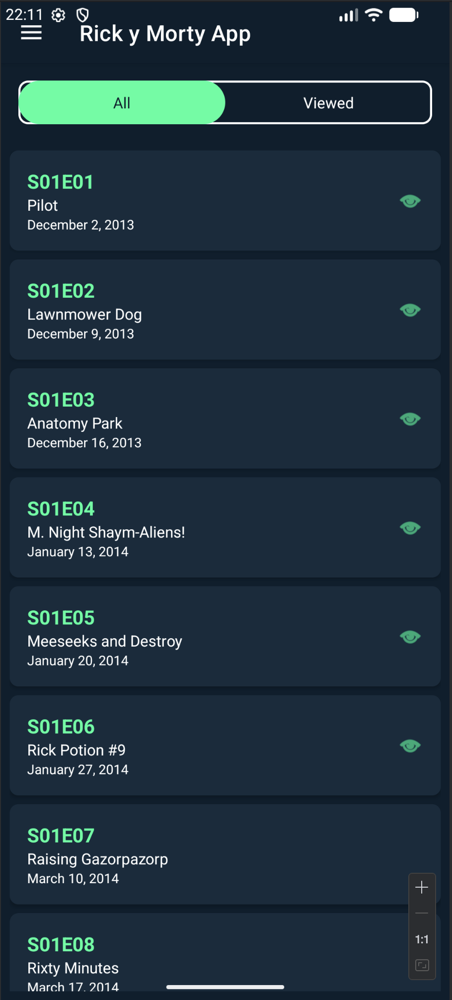
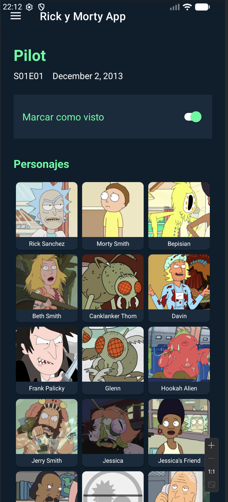
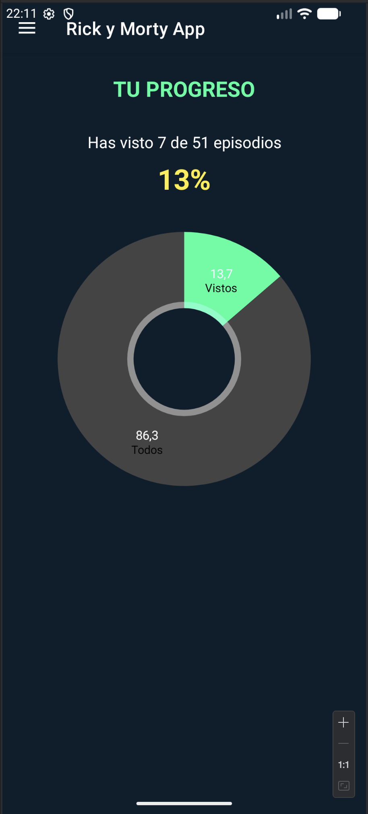
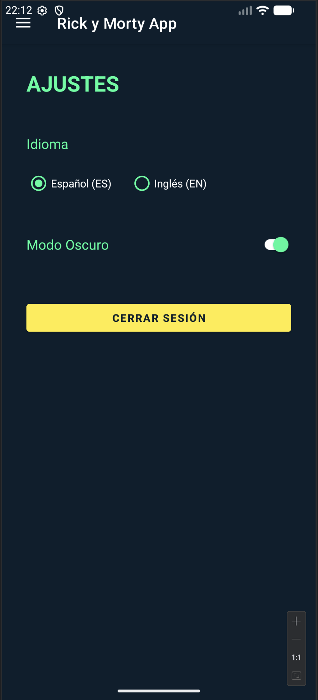
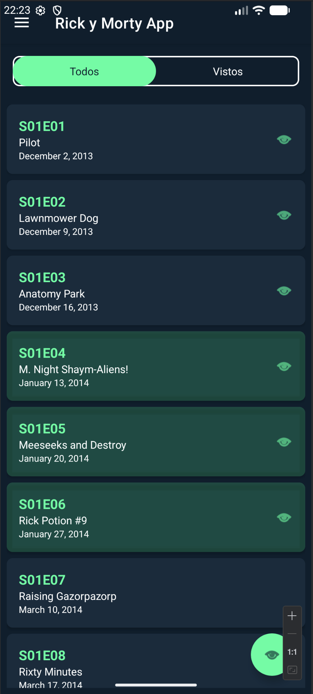

# Rick & Morty App - Proyecto DAM

¡Hola! Soy **Juan Carrasco**, alumno del ciclo de **Desarrollo de Aplicaciones Multiplataforma (DAM)** en modalidad a distancia en el **IES Aguadulce**.

Este repositorio contiene mi proyecto número 3 para el módulo de Programación Multimedia. El objetivo era crear una aplicación completa que consumiera una API externa, gestionara usuarios y permitiera persistencia de datos en la nube. He elegido la temática de *Rick y Morty* no solo porque la API es excelente para aprender, sino porque visualmente permite jugar mucho con los estilos.

---

## ¿De qué va el proyecto?

La aplicación es una especie de "Pasaporte de Aventuras" para los fans de la serie. Básicamente, permite ver el listado de episodios y marcar cuáles has visto. Pero no quería que fuera una lista simple, así que le he metido bastante "cariño" a la experiencia de usuario (UX) y a las funcionalidades extra.

### Lo que hace la app (y cómo lo he montado):

1.  **Conexión con la API (Retrofit):**
    La app se conecta a `rickandmortyapi.com` para traer los episodios paginados. Al principio tuve dudas sobre cómo gestionar la carga de imágenes, pero finalmente opté por **Glide**, que gestiona la caché de maravilla y hace que el scroll sea fluido.

2.  **Gestión de Usuarios (Firebase):**
    Para que cada usuario tenga su propia lista de "vistos", he implementado un sistema de Login y Registro completo usando **Firebase Authentication**.
    
3.  **Base de Datos en Tiempo Real (Firestore):**
    Aquí está el "corazón" de la app. Cuando marcas un episodio como visto, no se guarda en el móvil, sino en una colección de Firestore vinculada a tu ID de usuario. Esto permite que si desinstalas la app y vuelves a entrar, tus datos siguen ahí.
    * *Reto:* Cruzar los datos de la API (episodios brutos) con los de Firestore (marcados como vistos) sin bloquear la interfaz fue uno de los mayores desafíos, pero lo solucioné fusionando las listas en el Adaptador.

4.  **Estadísticas Visuales:**
    Quería que el usuario viera su progreso. He integrado la librería **MPAndroidChart** para generar un gráfico circular que se anima y te dice qué porcentaje de la serie has completado.

5.  **Multilenguaje y Temas:**
    He cumplido con el requisito de internacionalización (Inglés/Español) y el cambio de tema (Claro/Oscuro).
    * *Nota:* Para el **Modo Oscuro**, no me limité a invertir colores. He creado una paleta personalizada (`colors.xml` vs `values-night`) usando los colores oficiales de la serie (ese verde neón y azul oscuro característicos) para que se sienta nativo.

---

##  El "Extra Mile": Funcionalidades Avanzadas

Además de los requisitos básicos, quise ir un poco más allá para asegurar una nota alta y aprender más:

* **Selección Múltiple (Batch Selection):**
    Me parecía tedioso tener que entrar uno a uno para marcar episodios. Implementé una lógica en el `RecyclerView` que detecta una pulsación larga (`onLongClick`). Esto activa un modo de selección múltiple y hace aparecer un botón flotante (FAB) para guardar muchos episodios de golpe en Firebase usando "lotes" (`WriteBatch`), lo cual es mucho más eficiente que hacer 10 peticiones seguidas.

* **Detalle con Personajes:**
    En la pantalla de detalle, la API solo me daba URLs de los personajes. He creado una segunda llamada asíncrona que extrae los IDs de esas URLs y descarga las fotos y nombres de los personajes para mostrarlos en una cuadrícula (`GridLayout`).

---

## Así se ve la App

*(Aquí puedes ver cómo cambia la interfaz según el tema elegido)*

| Login | Lista (Modo Rick/Oscuro) | Detalle del Episodio |
|:---:|:---:|:---:|
|  |  |  |

| Estadísticas | Ajustes (Modo Claro) | Selección Múltiple |
|:---:|:---:|:---:|
|  |  |  |

---

## Tecnologías y Librerías

Para los curiosos, este es el stack técnico que he utilizado:

* **Lenguaje:** Kotlin (100%).
* **Arquitectura:** MVC con separación de responsabilidades (UI, Models, Network).
* **Networking:** Retrofit 2 + Gson Converter.
* **BaaS:** Firebase (Auth & Firestore).
* **UI Components:** RecyclerView, CardView, CoordinatorLayout, ConstraintLayout.
* **Gráficos:** MPAndroidChart.
* **Imágenes:** Glide.

---

## Conclusión

Este proyecto ha sido una gran oportunidad para consolidar todo lo aprendido durante el curso. Me he pegado bastante con la sincronización de hilos (evitar bloquear el Main Thread) y con el ciclo de vida de los Fragmentos al cambiar el idioma, pero estoy muy contento con el resultado final.

Espero que os guste. ¡Wubba Lubba Dub Dub!

**Juan Antonio Carrasco Sánchez**
IES Aguadulce - Curso 2025/26
